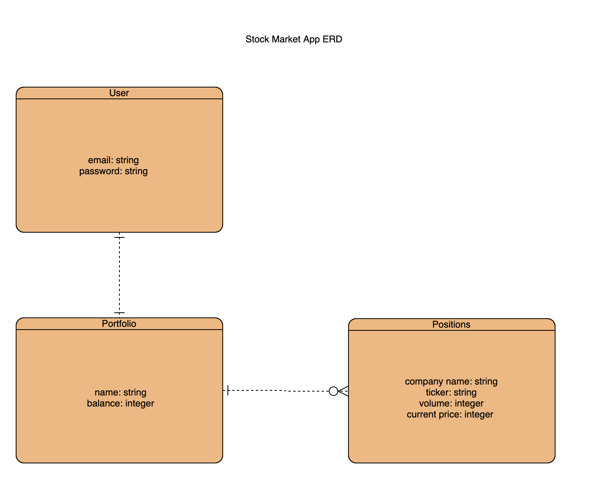

# Paper Trading App - Stonks
Stonks is an app designed with a goal to let people learn how to trade stocks with zero risk to lose money. In this app you can buy and sell real world stocks with virtual money.

The app takes in a stock symbol, volume and current price, checks if you have enough money available on your account, and creates a position, while reducing your account balance. WHen you close a position, it 'sells' the stocks with a current price and updates your balance.

## Technologies Used
* Ruby
* Ruby on Rails

I used React for the App`s structure, creating multiple dynamically updating components that render data from both my back and and a third party API.
To connect front end to the back end and make API calls, I used axios.
To add better structure and UX, I used React Bootstrap.

 Links:
 - [Deployed Website](https://elinagorshkova.github.io/paper-trade-client/)
 - [Client Repo](https://github.com/elinagorshkova/paper-trade-client)
 - [API Repo](https://github.com/elinagorshkova/paper-trade-api)
 - [API Deployed](https://mysterious-tundra-15808.herokuapp.com/)

 ## Process, Planning, Problem-Solving
 I started the project with brainstorming the back end structure. I researched a few existing stock market apps to determine what is a must-have in my own app. Then I created ERD for my future DataBase and moved to front end planning.
 In the back end I started with scaffolding the Potrolios table first. After modifying the routes and controllers for Portfolios and testingit with Postman, I created Positions table and went through the same steps as I did with Portfolios.

# ERD:

# Catalog of routes
## Routes
|  Verb |  Route | Result |
|-------|--------|--------|
| GET   | `/portfolios`  | Gets all user`s portfolios|
| POST  | `/portfolios`  | Creates a portfolio |
| UPDATE   | `/portfolios/id`  | Updates a portfolio  |
| DELETE   | `/portfolios/id`  | Deletes an portfolio  |
|-------|--------|--------|
| GET   | `/positions`  | Gets all user`s open positions|
| POST  | `/positions`  | Creates a position |
| UPDATE   | `/positions/id`  | Updates a position  |
| DELETE   | `/positions/id`  | Deletes a position  |

# Installation

* To work with the code:
- Fork and clone
- Run bundle install
- Feel free to use any part of teh code

## Status
Project is in progress.
Continue adding new features.

## License

This project is licensed under the terms of the MIT license. See the LICENSE file for details.

## Contact
Created by Elina Gorshkova(https://github.com/elinagorshkova, https://www.linkedin.com/in/egorshkova/) - feel free to contact me!
